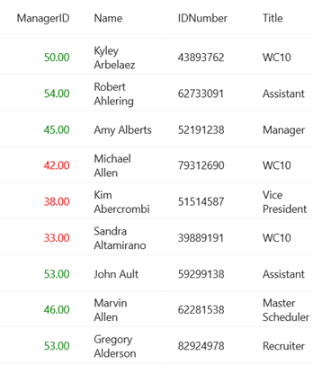

# Customize the Foreground color for cells in a column based on the cell content in Maui DataGrid
The .NET MAUI DataGrid (SfDataGrid) displays all the text values in DataGridCell with a default TextColor. However, SfDataGrid allows you to customize the TextColor color of the DataGridCell for the entire view and to some specific cells based on conditions. 
You can use the SfDataGrid.DefaultStyle property to change the TextColor of all DataGridCell in the view. To find out more, please refer to our documentation.
If you need to change the TextColor of a cell based on its value, you can use the CellStyle property in the DataGridColumn. You can create converters for the style properties to meet your requirements.
## C#
Refer the below code example for writing a converter to customize the cell TextColor based on conditions.
```C#
public class ColorConverter: IValueConverter
{
    public object Convert(object value, Type targetType, object parameter,CultureInfo culture)
    {
        int _value = (int)value;
        if (_value >= 45)
            return Colors.Green;
        return Colors.Red;
    }
    public object ConvertBack(object value, Type targetType, object parameter, CultureInfo culture)
    {
        return value;
    }
}
```
## XAML
Refer the below code example in which TextColor of the ManagerID column is customized based on conditions written in the converter. 
```XAML
<ContentPage.Resources>
  <ResourceDictionary>
    <local:StyleConverterForMarks x:Key="result"/>
  </ResourceDictionary>
</ContentPage.Resources>

<syncfusion:DataGridNumericColumn MappingName="ManagerID">
    <syncfusion:DataGridNumericColumn.CellStyle>
        <Style TargetType="syncfusion:DataGridCell">
            <Setter Property="TextColor"
        Value="{Binding ManagerID,Converter={StaticResource result}}" />
        </Style>
    </syncfusion:DataGridNumericColumn.CellStyle>
</syncfusion:DataGridNumericColumn>
```
The following screenshot shows the Foreground color for cells in a column based on the cell content,



Take a moment to pursue this [documentation](https://help.syncfusion.com/maui/datagrid/overview), where you can find more about Syncfusion .NET MAUI DataGrid (SfDataGrid) with code examples.
Please refer to this [link](https://www.syncfusion.com/maui-controls/maui-datagrid) to learn about the essential features of Syncfusion .NET MAUI DataGrid(SfDataGrid).
### Conclusion
I hope you enjoyed learning about how to bind DataTable collection to MAUI DataGrid (SfDataGrid).
You can refer to our [.NET MAUI DataGrid’s feature tour](https://www.syncfusion.com/maui-controls/maui-datagrid) page to know about its other groundbreaking feature representations. You can also explore our .NET MAUI DataGrid Documentation to understand how to present and manipulate data.
For current customers, you can check out our .NET MAUI components from the [License and Downloads](https://www.syncfusion.com/account/downloads) page. If you are new to Syncfusion, you can try our 30-day free trial to check out our .NET MAUI DataGrid and other .NET MAUI components.
If you have any queries or require clarifications, please let us know in comments below. You can also contact us through our [support forums](https://www.syncfusion.com/forums), [Direct-Trac](https://support.syncfusion.com/account/login?ReturnUrl=%2Faccount%2Fconnect%2Fauthorize%2Fcallback%3Fclient_id%3Dc54e52f3eb3cde0c3f20474f1bc179ed%26redirect_uri%3Dhttps%253A%252F%252Fsupport.syncfusion.com%252Fagent%252Flogincallback%26response_type%3Dcode%26scope%3Dopenid%2520profile%2520agent.api%2520integration.api%2520offline_access%2520kb.api%26state%3D8db41f98953a4d9ba40407b150ad4cf2%26code_challenge%3DvwHoT64z2h21eP_A9g7JWtr3vp3iPrvSjfh5hN5C7IE%26code_challenge_method%3DS256%26response_mode%3Dquery) or [feedback portal](https://www.syncfusion.com/feedback/maui?control=sfdatagrid). We are always happy to assist you!